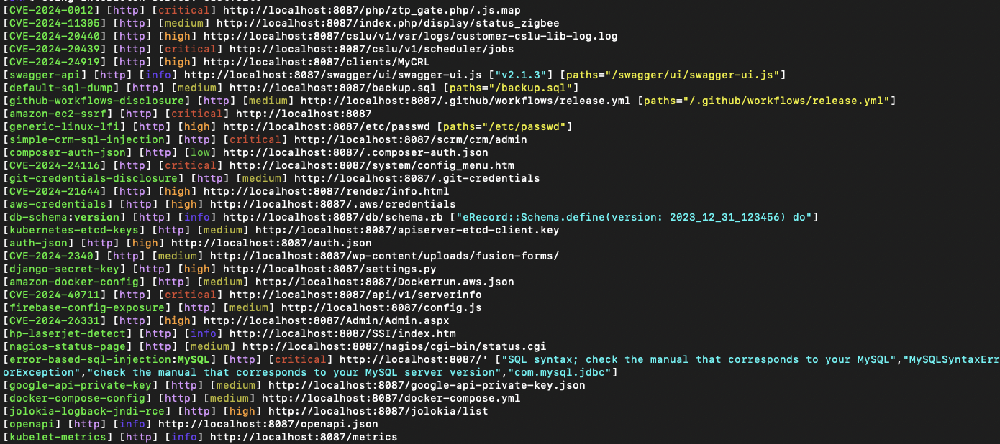

# Introduction

```
 ....
''. :   __
   \|_.'  `:       _.----._//_          Utku Sen's          
  .'  .'.`'-._   .'  _/ -._ \)-.----O   ___       _ _   ___          _       
 '._.'.'      '--''-'._   '--..--'-`   | _ ) __ _(_) |_| _ \___ _  _| |_ ___    
  .'.'___    /`'---'. / ,-'`           | _ \/ _` | |  _|   / _ \ || |  _/ -_) 
_<__.-._))../ /'----'/.'_____:'.       |___/\__,_|_|\__|_|_\___/\_,_|\__\___| 
:            \ ]              :  '.                                    
:  Acme       \\              :    '.  A web honeypot library to create decoy  
:              \\__           :    .'  endpoints to detect and mislead attackers
:_______________|__]__________:...'                    
```

A web honeypot project that serves realistic, vulnerable-looking endpoints to detect vulnerability scans and mislead attackers by providing false positive results. It can be imported as a library into your project and is ready to use with its rules.

## Why Do We Need This?

1. **Early Warning System**: You will get an alert when an attacker tries to exploit a decoy vulnerability that Baitroute serves. You will get notified about that attempt. You can view attacker information (IP, headers, request body etc.).

2. **Waste Attacker's Time**: When you enable all rules, attackers' vulnerability scans become a mess with false-positive results. They'll waste considerable time trying to determine which vulnerabilities are genuine. Following screenshot is taken from a Nuclei scan:



## Features

- **Easy Integration**: Seamlessly integrates with popular web frameworks in Go, Python, and Javascript
- **Minimal Overhead**: Runs alongside your existing application without impacting performance
- **Ready-to-use Rules**: Baitroute comes with a set of ready-to-use vulnerability/misconfiguration rules that you can use out of the box.
- **Configurable**: You can easily create and add your own rules. Configure status codes, headers, and response bodies to create realistic-looking endpoints
- **Selective Loading**: You don't need to load all rules—just load the bait rules you require.
- **Alert Integration**: You can send alerts to other systems such as Sentry, Datadog, Slack or various SIEM software.

## Supported Languages and Frameworks

The library currently supports the following languages and frameworks:

### Go
- Standard `net/http` package
- Fiber
- Gin
- Chi
- Echo
- FastHTTP

### Python
- Flask
- FastAPI
- Django

### JavaScript (Experimental)
- Express
- Node.js


## Installation

### Getting the Rules

The rules are included in the main repository. When you clone the project, you'll get them automatically:
```bash
git clone https://github.com/utkusen/baitroute.git
cp -r baitroute/rules ./rules
```

An example project structure:

```
your-project/
├── rules/        # Copied from the cloned repository
├── main.go       # Your application code
└── ...
```

## Usage

### Go Implementation

1. **Installation**

In your existing Go project, add the baitroute library to your dependencies:
```bash
go get github.com/utkusen/baitroute/go
```

2. **Basic Usage**

Example codes are in the `go/example` directory. This is the basic usage for the `net/http` package:

```go
package main

import (
	"log"
	"net/http"
	"path/filepath"
	"runtime"

	"github.com/utkusen/baitroute/go/pkg/baitroute"
)

func main() {
	// Create a new ServeMux
	mux := http.NewServeMux()

	// Create a real endpoint
	mux.HandleFunc("/", func(w http.ResponseWriter, r *http.Request) {
		w.Write([]byte("Welcome to my web application!"))
	})

	// Get the directory of the current file
	_, filename, _, _ := runtime.Caller(0)
	currentDir := filepath.Dir(filename)
	rulesPath := filepath.Join(currentDir, "..", "..", "..", "rules")

	// Initialize baitroute with default rules
	b, err := baitroute.NewBaitRoute(rulesPath)
	if err != nil {
		if err, ok := err.(*baitroute.EndpointConflictError); ok {
			log.Fatalf("Endpoint conflict detected in %s: %s %s is already defined",
				err.SourceFile, err.Method, err.Path)
		}
		log.Fatalf("Failed to initialize baitroute: %v", err)
	}

	/* Alternatively, you can select specific rules to load:
	b, err := baitroute.NewBaitRoute(rulesPath,
		"exposures/aws-credentials",
		"exposures/sql-dump",
		"info/ibm-http-server",
	)
	*/

	// Simple alert logging with SIEM integration comment
	b.OnBaitHit(func(alert baitroute.Alert) {
		// SIEM Integration Point: Forward these alerts to your SIEM system
		log.Printf("Bait Alert: Method=%s Path=%s SourceIP=%s Rule=%s",
			alert.Method,
			alert.Path,
			alert.SourceIP,
			alert.RuleName)

		/* Example: Sentry Integration
		sentry.WithScope(func(scope *sentry.Scope) {
			scope.SetLevel(sentry.LevelWarning)
			scope.SetExtra("source_ip", alert.SourceIP)
			scope.SetExtra("true_client_ip", alert.TrueClientIP)
			scope.SetExtra("x_forwarded_for", alert.XForwardedFor)
			scope.SetExtra("rule_name", alert.RuleName)
			scope.SetExtra("method", alert.Method)
			scope.SetExtra("path", alert.Path)
			scope.SetTag("event_type", "bait_hit")
			sentry.CaptureMessage("Security Alert: Bait Endpoint Hit")
		})

		Example: Splunk Integration
		splunk.Send(&splunk.Event{
			Source:    "honeypot",
			Event:     "bait_hit",
			Severity:  "warning",
			SourceIP:  alert.SourceIP,
			ClientIP:  alert.TrueClientIP,
			X-Forwarded-For: alert.XForwardedFor,
			Method:    alert.Method,
			Path:      alert.Path,
			RuleName:  alert.RuleName,
			Timestamp: alert.Timestamp,
		})


		*/
	})

	// Register bait endpoints
	if err := b.RegisterWithHTTP(mux); err != nil {
		log.Fatalf("Failed to register bait endpoints: %v", err)
	}

	// Start the server
	log.Println("Server starting on http://localhost:8087")
	if err := http.ListenAndServe(":8087", mux); err != nil {
		log.Fatalf("Failed to start server: %v", err)
	}
}

```

3. **Running the Example**
```bash
# Navigate to go directory
cd go/examples/http

# Install dependencies
go mod tidy

# Run the example
go run main.go
```

### Python Implementation

1. **Installation**

Install the library and required dependencies:
```bash
# Install baitroute
pip install git+https://github.com/utkusen/baitroute.git#subdirectory=py

```

2. **Basic Usage**

Example codes are in the `py/example` directory. This is the basic usage for the `fastapi` package:

```python
from fastapi import FastAPI
from baitroute import BaitRoute, Alert
from baitroute.fastapi_integration import register_with_fastapi
import uvicorn

app = FastAPI()

# Create a baitroute instance with rules from the rules directory
# You can also specify specific rules to load instead of all:
# baitroute = BaitRoute("../../rules", selected_rules=["exposures/aws-credentials", "exposures/circleci-ssh-config"])
baitroute = BaitRoute("../../rules")

# Set up alert handler
# This is a simple console logging handler, but you can implement more sophisticated handlers:
# - Send alerts to Sentry:
#   def handle_bait_hit(alert):
#       sentry_sdk.capture_message(
#           f"Bait endpoint hit: {alert.path}",
#           extras={
#               "source_ip": alert.source_ip,
#               "rule": alert.rule_name,
#               "request_data": alert.request_data
#           }
#       )
#
#
# - Send to Splunk:
#   def handle_bait_hit(alert):
#       splunk_client.send(
#           json.dumps({
#               "time": alert.timestamp.timestamp(),
#               "event": "bait_hit",
#               "src_ip": alert.source_ip,
#               "path": alert.path,
#               "data": alert.request_data
#           })
#       )
def handle_bait_hit(alert: Alert):
    print(f"🚨 Bait hit detected!")
    print(f"Path: {alert.path}")
    print(f"Method: {alert.method}")
    print(f"Remote Address: {alert.remote_addr}")
    print(f"Headers: {alert.headers}")
    if alert.body:
        print(f"Body: {alert.body}")
    print("---")

baitroute.on_bait_hit(handle_bait_hit)

# Register baitroute endpoints
register_with_fastapi(app, baitroute)

# Your normal routes
@app.get("/")
async def home():
    return {"message": "Welcome to the real application!"}

if __name__ == "__main__":
    uvicorn.run(app, host="0.0.0.0", port=8087) 
```

3. **Running the Example**
```bash
# Navigate to Python examples directory
cd py/examples

# Run the FastAPI example
python fastapi_example.py
```

### JavaScript Implementation

1. **Installation**

Install the library:
```bash
npm install github:utkusen/baitroute#main/js
# or
yarn add github:utkusen/baitroute#main/js
```

2. **Basic Usage**

Example codes are in the `js/example` directory. This is the basic usage for the `express` package:

```typescript
import express from 'express';
import { join } from 'path';
import { ExpressBaitRoute } from '../../src/integrations/express';

const app = express();
const port = process.env.PORT || 3000;

// Create a real endpoint
app.get('/', (req, res) => {
  res.send('Welcome to my web application!');
});

// Initialize baitroute
const baitroute = new ExpressBaitRoute({
  rulesDir: join(__dirname, '../../../rules'),
  // Optional: specify which rules to load (example)
  /* 
  selectedRules: [
    'exposures/aws-credentials',
    'exposures/circleci-ssh-config',
    'vulnerabilities/sql-injection'
  ],
  */
});

// Set up alert handler
baitroute.setAlertHandler(async (alert) => {
  // Basic console logging
  console.log('🚨 Bait endpoint accessed:', {
    path: alert.path,
    method: alert.method,
    sourceIP: alert.remoteAddr,
    headers: alert.headers,
    body: alert.body
  });

  // Example: Sentry Integration
  /* 
  // import * as Sentry from '@sentry/node';
  // Sentry.init({ dsn: "your-sentry-dsn" });

  Sentry.withScope((scope) => {
    scope.setLevel('warning');
    scope.setExtra('source_ip', alert.sourceIP);
    scope.setExtra('true_client_ip', alert.trueClientIP);
    scope.setExtra('x_forwarded_for', alert.xForwardedFor);
    scope.setExtra('rule_name', alert.ruleName);
    scope.setExtra('method', alert.method);
    scope.setExtra('path', alert.path);
    scope.setTag('event_type', 'bait_hit');
    Sentry.captureMessage('Security Alert: bait Endpoint Hit');
  });
  */
});

// Register baitroute endpoints
baitroute.registerWithExpress(app)
  .then(() => {
    app.listen(port, () => {
      console.log(`Example app listening at http://localhost:${port}`);
    });
  })
  .catch((error) => {
    console.error('Failed to initialize baitroute:', error);
    process.exit(1);
  });
```

3. **Running the Example**

To run the Express example directly:
```bash
# Install ts-node globally (if not installed)
npm install -g ts-node typescript

# Navigate to js directory and install dependencies
cd js && npm install

# Build the project
npm run build

# Run the Express example
cd examples/express
ts-node app.ts
```


## Testing

After starting any of the implementations, you can test the bait endpoints. For example:

```bash
# Test AWS credentials bait
curl http://localhost:3000/.aws/credentials

```

## Writing Your Own Rules

Rules are defined in YAML files. Each rule specifies:
- Path
- HTTP method
- Response status code
- Content type
- Response body
- Custom headers (optional)

Example rule:
```yaml
- path: /.aws/credentials
  method: GET
  status: 200
  content-type: text/plain
  headers:
    - Server: "nginx/1.25.2"
  body: |
    [default]
    aws_access_key_id = AKIA...
    aws_secret_access_key = ...
```

## License

This project is licensed under the GPL-3.0 License - see the LICENSE file for details. 